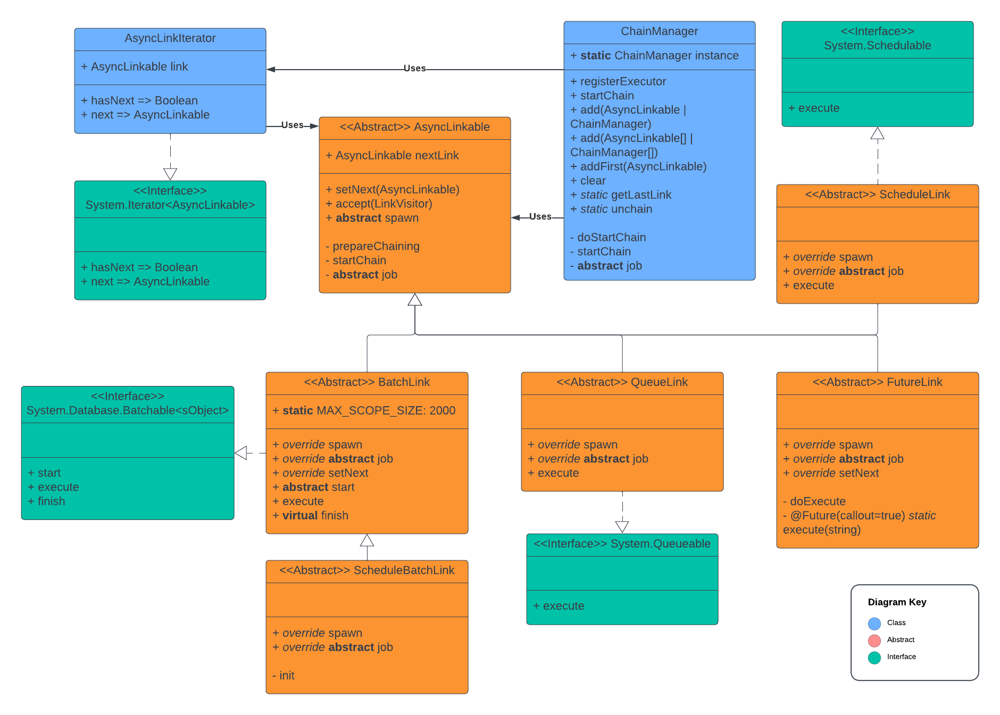

## Apex AsyncLinkable  [](https://codecov.io/gh/scolladon/apex-async-linkable)

This library help to deal with asynchronous software architecture issues.
The approach of the library is to asbtract the concept of async transaction and to provide a layer to deal with chaining and spawning, letting the customer the responsibility to write business rules code.

The library help chaining together every kind of asynchronous processes (Batchable, Schedulable, Queueable, Future).

It ensures they will be executed sequentially.
The library comes with features (Chain manager, iterator, visitor) and mechanisms (executor pattern) to deal with low level orchestration.

The library provides all the classes required to chain all kind of Async jobs.
It helps improving reusability of asynchronous implementations by making them agnostic of their execution context.

The library will help you chain your async jobs altogether, without the need for them to know each other or to take care of the context.

Per example let's say we have a Service on Case dealing with business rules. You need to use this service inside a Batch.
You don't want to care about the specificity of its implementation.
You don't want to have to change your implementation if it does not work anymore in asynchronous process

The owner of the service does not want to care about other consumer if he changes its implementation (callout, queueable, platform event, etc)

The library help with asynchronous process specific governor limit. As chained job will not be spawned all at once in the same transaction but one by one, jobs will be protected agains the "Too many queueable jobs added to the queue: 2" exception when spawned inside an asynchronous process for example.

Using the global `ChainManager` to chain and spawn async job ensure they will be spawn if possible and when appropriate.

The library is also an efficient solution to Flex Queue management, instead of being added to the flex queue the asynchronous job are maintained on the heap and added to the flex queue when the previous process finish.

Let's say you have a transaction where 3 queueable are enqueued, they will be put in the Flex Queue and will take 3 places. They will be spawned in the order of enqueueing.
By chaining the job altogether only the first will be on the Flex Queue. When executed it will spawn the next one and so one.

It is like a lazy queueing mechanism and can drastically relieve Flex Queue load and scale large complexe async implementation.

## Use cases

Use this library when the flex queue happens to full often and refuses async job.
Use this library when you need to use service spawning asynchronous job inside asynchronous job and you don't want to refactor the service you are calling (not the owner of the service, not related to the requirement you are currently solving)

/!\ the library will not diminish the number of asynchronous job spawned per day!
But it will help releasing the pressure on the flex queue.

## Installation

```bash
$ sfdx force:source:deploy -p chain/src/lib
```

## Usage

AsyncLinkable implementation is a linked list of special convenient async type
holding chaining and spawning properties abstracted to the developer.

### How to use the `ChainManager`

Use the global `ChainManager.instance` to

- register a process responsible for the execution of the chain

```apex
ChainManager.instance.registerExecutor('My Process');
```

- add new async job to the chain.

```apex
final AsyncLinkable asyncJob = new MyAsyncJob();
ChainManager.instance.add(asyncJob);
```

- spawn the chain

```apex
ChainManager.instance.startChain();
// Or
ChainManager.instance.startChain('My Process');
```

### Async type implementation example

Extend the AsyncLinkable type of your choice and then implement the `job` method.
The `job` method will be called by the framework when the async processus will be spawn.
_`start` method must also be overridden for the BatchLink and ScheduleBatchLink class_

The `job` method will contain your business logic. It can then access the private attributes of your class and the protected ones of the base class.

If you need some extra interface to make your code work, it is up to you to add them (such as `Database.Stateful`, `Database.AllowsCallouts`, etc).

Example for Batchable:

```apex
// Subclass BatchLink for example
public class BatchLink_EXAMPLE extends BatchLink {
  public override Database.QueryLocator start(
    Database.BatchLinkableContext bc
  ) {
    return Database.getQueryLocator('select id from account limit 1');
  }

  public BatchLink_EXAMPLE() {
    super();
  }

  protected override void job() {
    System.Debug('BatchLink_EXAMPLE');

    // Acces records queried by the start method
    final List<Account> accounts = (List<Account>) this.scope;
  }
}
```

Example for Scheduled Batchable:

```apex
// Subclass ScheduleBatchLink for example
public class ScheduleBatchLink_EXAMPLE extends ScheduleBatchLink {
  public override Database.QueryLocator start(
    Database.BatchLinkableContext bc
  ) {
    return Database.getQueryLocator('select id from account limit 1');
  }

  public ScheduleBatchLink_EXAMPLE() {
    super();
  }

  protected override void job() {
    System.Debug('ScheduleBatchLink_EXAMPLE');

    // Acces records queried by the start method
    final List<Account> accounts = (List<Account>) this.scope;
  }
}
```

Example for Schedulable:

```apex
// Subclass ScheduleLink for example
public class ScheduleLink_EXAMPLE extends ScheduleLink {
  public ScheduleLink_EXAMPLE() {
    super();
  }

  protected override void job() {
    System.Debug('ScheduleLink_EXAMPLE');
  }
}
```

Example for Queueable:

```apex
//Subclass QueueLink for example
public class QueueLink_EXAMPLE extends QueueLink {
  public QueueLink_EXAMPLE() {
    super();
  }

  protected override void job() {
    System.Debug('BatchLink_EXAMPLE');
  }
}
```

Example for Future:

```apex
//Subclass FutureLink for example
public class FutureLink_EXAMPLE extends FutureLink {
  public FutureLink_EXAMPLE() {
    super();
  }

  protected override void job() {
    System.Debug('FutureLink_EXAMPLE');
  }
}
```

Example chaining all of those;

```apex
// Chain both and execute them
public class Service {
  public static void doService() {
    ChainManager.instance
      .add(new BatchLink_EXAMPLE())
      .add(new ScheduleBatchLink_EXAMPLE('scheduled batch in 1min', 1))
      .add(new ScheduleLink_EXAMPLE('scheduled', '0 0 * * * ?'))
      .add(new QueueLink_EXAMPLE())
      .add(new FutureLink_EXAMPLE())
      .startChain();
  }
}
```

### Executor principle

The executor pattern used in this library help to determine what is the parent process responsible for the global execution of the chain.
It avoid the code to spawn the chain too early and ensure it is spawn in the end.

#### Simple example

Let's say we have a method calling a service and then spawning a queueable:

```apex

class Service {
 public static void execute() {
   ChainManager.instance.add(new AsyncJob()).startChain();
 }
}

class Controller {
 public void simpleExample() {
   Service.execute(); // spawn an async job
   ChainManager.instance.add(new MyQueue()).startChain();// spawn an async job
 }
}
```

Let's break it down line by line:

- add AsyncJob startChain without executor => no executor registered => spawn it
- add MyQueue
- startChain with executor => no executor registered => spawn it

As the controller does not have register an executor, the chain was spawned twice.
It can fail when `simpleExample` is executed inside a queueable because it is possible to spawn an async job only once in this kind of context.

What we should do is register an executor.
It says: spawn the chain only if the executor provided is the same as the one registered.
This way the code does not have to know if it is called first and need to spawn the chain. This way it is possible to compose business rule with existing service, without knowing how it is implemented (async or not) and without caring about future evolution (adding async processing inside it):

Let's say we have a method calling a service and then spawning a queueable:

```apex

class Service {
 public static void execute() {
   // Start chain does not specify the executor
   ChainManager.instance.add(new AsyncJob()).startChain();
 }
}

class Controller {
 private static final String ControllerExecutor = 'ControllerExecutor';
 public void simpleExample() {
   ChainManager.instance.registerExecutor(ControllerExecutor);
   Service.execute(); // chain the async but does not spawn it
   ChainManager.instance.add(new MyQueue()).startChain(ControllerExecutor);// Enqueue an async job chained with the one from service.execute
 }
}
```

Let's break it down line by line:

- register executor 'ControllerExecutor'
- add AsyncJob
- startChain without executor => null != registered executor => do nothing
- add MyQueue
- startChain with executor => 'ControllerExecutor' == 'ControllerExecutor' => spawn the first element from the list

#### More complex Trigger example

Look at the recipes folder complex example.
There is a trigger and the goal is to chain together treatment from before and after events. And also chaining every intermediate async processes triggered by services called by the trigger handler.

Using an executor allow us to easily write the code without having to care much if service methods called will spawn async process.
This makes the code safer to run in async process.

Per example updating a list of account inside a Queue will be possible with this trigger without having to check if it is run inside a queueable job or not to spawn the async processes running business logic.

#### Debounce example

Look at the recipes folder `debounce` example
Here the code check for other instance of the same `AsyncApexJob` and spawn the job only if it is not already planned.
If the job is spawned, then it is put in the back of the flex queue to debounce it.
Another approach could be to discard it and reschedule it using the same spawn method to reuse potential delay implemented (queue, schedulable job, schedulable batch).

#### Throttle example

Look at the recipes folder `throttle` example
Here the code check for other instance of the same `AsyncApexJob` and spawn the job only if it is not already planned

### Iterate over a chain

Use the `AsyncLinkIterator` as a convenient way to iterate over an `AsyncLink`:

```apex
final AsyncLinkable queueLink = new MyQueueLink();
final AsyncLinkable anotherQueueLink = new MyOtherQueueLink();
final AsyncLinkable yetAnotherQueueLink = new MyYetOtherQueueLink();
queueLink.setNext(anotherQueueLink);
anotherQueueLink.setNext(yetAnotherQueueLink);
final Iterator<AsyncLinkable> iterator = new AsyncLinkIterator(queueLink);
AsyncLinkable currentLink;
while (iterator.hasNext()) {
  currentLink = iterator.next();
  // Do stuff
}
```

### Implement the Visitor pattern

Use the `LinkVisitor` interface to create an AsyncLinkableVisitor and implement custom logic to the whole linked list.
`ChainManager.unchain` and `ChainManager.getLastLink` implementation is done using this pattern.

Here is an example to extract from the chain every element of a certain type:

```apex
private class ExtractElement implements AsyncLinkable.LinkVisitor {
  private AsyncLinkable link;
  private System.Type typeToExtract;

  public ExtractElement(final System.Type typeToExtract) {
    this.typeToExtract = typeToExtract;
  }

  public void visit(final AsyncLinkable link) {
    this.link = link;
  }

  public List<AsyncLinkable> getLinks() {
    final List<AsyncLinkable> links = new List<AsyncLinkable>();
    if (this.link == null) {
      return links;
    }
    final Iterator<AsyncLinkable> iterator = new AsyncLinkIterator(this.link);
    AsyncLinkable currentLink;
    while (iterator.hasNext()) {
      currentLink = iterator.next();
      if (
        String.valueOf(currentLink).split(':')[0] ==
        this.typeToExtract.getName()
      ) {
        links.Add(currentLink);
      }
    }
    return links;
  }
}
```

## Software Architecture



## Versioning

[SemVer](http://semver.org/) is used for versioning.

## Authors

- **Sebastien Colladon** - _Initial work_ - [scolladon](https://github.com/scolladon)

## License

This project is licensed under the MIT License - see the [LICENSE.md](LICENSE.md) file for details
